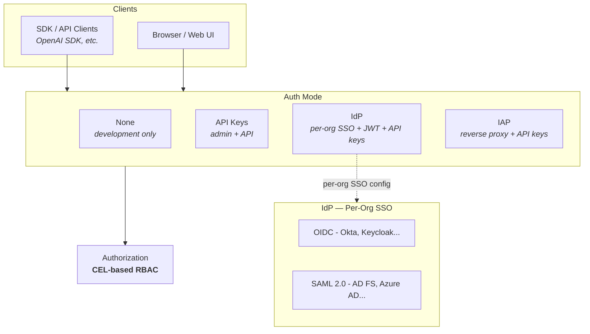

import { Callout } from "fumadocs-ui/components/callout";

Hadrian uses a single `[auth.mode]` setting that determines how all requests are authenticated across both the API and the admin panel.

## Auth Modes

Configure authentication by setting `[auth.mode]` in `hadrian.toml`. Four modes are available:

| Mode      | Config             | Description                                                      |
| --------- | ------------------ | ---------------------------------------------------------------- |
| `none`    | `type = "none"`    | No authentication. Development only.                             |
| `api_key` | `type = "api_key"` | API key required for all access (admin panel + API).             |
| `idp`     | `type = "idp"`     | Per-org SSO with session cookies, JWT validation, and API keys.  |
| `iap`     | `type = "iap"`     | Reverse proxy headers for admin access, API keys for API access. |

### Supporting Config Sections

| Section                     | Used by                 | Purpose                                                    |
| --------------------------- | ----------------------- | ---------------------------------------------------------- |
| `[auth.api_key]`            | `api_key`, `idp`, `iap` | API key settings (header name, key prefix, cache TTL)      |
| `[auth.session]`            | `idp`                   | Session cookie settings (cookie name, secure flag, secret) |
| IAP fields in `[auth.mode]` | `iap`                   | Identity and email header names from the reverse proxy     |

## Deployment Scenarios

Pick the scenario closest to your deployment. Each includes a minimal working config.

| #   | Scenario                                    | Mode      | Web UI experience                                    | SDK / API access       |
| --- | ------------------------------------------- | --------- | ---------------------------------------------------- | ---------------------- |
| 1   | [Local development](#1-local-development)   | `none`    | No login, everything open                            | No credentials needed  |
| 2   | [API key](#2-api-key)                       | `api_key` | Enter API key to log in                              | API key                |
| 3   | [SSO / IdP](#3-sso--idp)                    | `idp`     | Per-org SSO login, session cookie handles everything | API key or per-org JWT |
| 4   | [Reverse proxy (IAP)](#4-reverse-proxy-iap) | `iap`     | Proxy handles login                                  | API key                |

---

### 1. Local development

No authentication. All requests proceed anonymously. The admin panel, chat UI, and API are all open.

```toml
[auth.mode]
type = "none"
```

<Callout type="warn">
  Never use `type = "none"` in production. Requests are unauthenticated and usage cannot be
  attributed to users.
</Callout>

### 2. API key

API keys required for all access. The admin panel shows an "enter API key" login screen. SDK and API clients send keys via headers.

```toml
[auth.mode]
type = "api_key"

[auth.api_key]
header_name = "X-API-Key"
key_prefix = "gw_"
cache_ttl_secs = 300
```

**Getting started:** Use the [bootstrap API key](/docs/configuration/auth#bootstrap-configuration) to create the initial organization and users. Then create API keys via the admin panel for each user. Paste a key into the chat UI settings or pass it to the OpenAI SDK.

### 3. SSO / IdP

Per-org SSO for browser sessions, with API key and JWT support on `/v1/*` endpoints. Each organization configures their own OIDC or SAML provider through the Admin UI at runtime.

```toml
[auth.mode]
type = "idp"

[auth.api_key]
key_prefix = "gw_"
cache_ttl_secs = 300

[auth.session]
cookie_name = "hadrian_session"
secure = true
secret = "${SESSION_SECRET}"

[auth.bootstrap]
api_key = "${HADRIAN_BOOTSTRAP_KEY}"
auto_verify_domains = ["acme.com"]
```

**Getting started:** Use the [bootstrap API key](/docs/configuration/auth#bootstrap-configuration) to create organizations. Each org admin then configures their IdP via the [SSO Admin Guide](/docs/features/sso-admin-guide). Users are auto-provisioned on first SSO login. Per-org SSO configs automatically enable JWT validation on `/v1/*` endpoints -- no global OIDC configuration needed.

<Callout type="info">
  There is no global OIDC or SAML config in `hadrian.toml`. All identity provider configurations are
  per-organization and managed through the Admin UI. This enables multi-tenant deployments where
  each organization uses a different IdP.
</Callout>

### 4. Reverse proxy (IAP)

Trust identity headers from an authenticating reverse proxy (Cloudflare Access, Tailscale, oauth2-proxy, etc.) for admin access. API access uses API keys.

```toml
[server.trusted_proxies]
cidrs = ["173.245.48.0/20", "103.21.244.0/22"]

[auth.mode]
type = "iap"
identity_header = "Cf-Access-Authenticated-User-Email"
email_header = "Cf-Access-Authenticated-User-Email"

[auth.api_key]
key_prefix = "gw_"
cache_ttl_secs = 300
```

**Getting started:** Configure your reverse proxy to authenticate all traffic to Hadrian and forward identity headers. Create API keys via the admin panel for chat UI and SDK access.

<Callout type="error">
  Always configure `[server.trusted_proxies]` to prevent header spoofing. Without this, attackers
  can forge identity headers and impersonate any user.
</Callout>

<Callout type="info">
  In `iap` mode, both proxy headers and API keys work for authentication. The proxy authenticates
  admin panel access, while API keys authenticate `/v1/*` requests.
</Callout>

## Architecture



### Default Behavior

When `[auth.mode]` is omitted from `hadrian.toml`, authentication defaults to `type = "none"`. This means:

- **API requests** proceed without credentials. A default anonymous user and organization are created for usage tracking.
- **Admin routes** are unprotected -- the web UI works without login.
- **RBAC is permissive** -- all authorization checks pass automatically.

#### Credential Handling in No-Auth Mode

Even with `type = "none"`, the gateway validates credentials that are explicitly provided:

| Scenario                                                    | Result                                     |
| ----------------------------------------------------------- | ------------------------------------------ |
| No credentials sent                                         | Request proceeds as anonymous              |
| Valid credentials sent                                      | Request proceeds as the authenticated user |
| Invalid credentials sent (expired JWT, wrong API key, etc.) | **401 Rejected**                           |

This means you can incrementally adopt authentication -- existing anonymous clients continue working while authenticated clients get identity tracking and RBAC. However, clients must not send placeholder or invalid credentials.

## API Key Authentication

API keys are the primary method for programmatic access to `/v1/*` endpoints. Keys are created via the Admin UI or API and validated against the database.

```bash
# Using X-API-Key header
curl -H "X-API-Key: gw_live_abc123..." \
  https://gateway.example.com/v1/chat/completions

# Using Authorization header (OpenAI-compatible)
curl -H "Authorization: Bearer gw_live_abc123..." \
  https://gateway.example.com/v1/chat/completions
```

**Key features:**

- Configurable prefix (`gw_live_`, `gw_test_`, etc.)
- Budget limits (daily/monthly caps)
- Expiration dates
- Usage tracking per key
- Owner binding (org, team, project, or user)

In `api_key` mode, API keys authenticate everything -- including the admin panel. In `idp` and `iap` modes, API keys authenticate `/v1/*` endpoints alongside the mode's primary mechanism.

### Format-Based Detection

When both API keys and JWTs are accepted (in `idp` mode), the gateway uses format-based detection:

- **`X-API-Key` header**: Always validated as an API key
- **`Authorization: Bearer` header**: Tokens starting with the API key prefix (default `gw_`) are validated as API keys; all others are validated as JWTs

## Per-Org JWT Routing

In `idp` mode, per-org SSO configurations automatically enable JWT validation on `/v1/*` endpoints. There is no global JWT configuration in the config file -- all JWT validation derives from per-org SSO configs.

**How it works:**

1. **Decode `iss` claim** -- Extract the issuer from the JWT without verifying the signature yet
2. **Per-org registry lookup** -- Search the `GatewayJwtRegistry` for validators matching that issuer
3. **Lazy-load from DB** -- On cache miss, query the database for enabled OIDC SSO configs with that issuer, perform OIDC discovery to fetch the JWKS URI, and build a validator
4. **Validate** -- Verify the signature, expiry, audience, and issuer against the matched validator

**Key behaviors:**

- Validators are cached across requests -- JWKS keys are not re-fetched per request
- Unknown issuers are negatively cached for 60 seconds to prevent DB query amplification
- When an SSO config is created or updated via the Admin API, the registry is updated immediately
- Multiple organizations can share the same issuer (each gets its own validator with its own audience)

<Callout type="info">
  Per-org JWT routing only applies in `idp` mode. Per-org SSO configs provide all JWT validation
  automatically -- no global `[auth.gateway.jwt]` section is needed.
</Callout>

<Cards>
  <Card title="Gateway Auth Configuration" href="/docs/configuration/auth#gateway-authentication" />
</Cards>

## Session-Based Authentication

In `idp` mode, browser sessions use session cookies set during the SSO login flow. The session cookie authenticates both `/admin/*` and `/v1/*` requests, so users log in once and the chat UI works immediately -- no API key needed.

### OIDC / SSO

Full OpenID Connect flow with browser redirects. Works with any OIDC-compliant identity provider:

| Provider            | Notes                                     |
| ------------------- | ----------------------------------------- |
| Okta                | Enterprise SSO with MFA                   |
| Auth0               | Developer-friendly with many integrations |
| Keycloak            | Self-hosted, open source                  |
| Azure AD / Entra ID | Microsoft 365 integration                 |
| Google Workspace    | Google account authentication             |
| OneLogin            | Enterprise identity management            |

### SAML 2.0

SAML 2.0 authentication for enterprise identity providers that require the Security Assertion Markup Language protocol:

| Provider            | Notes                             |
| ------------------- | --------------------------------- |
| AD FS               | Windows Server Active Directory   |
| Azure AD / Entra ID | Enterprise SAML application       |
| Okta                | Native SAML application templates |
| Keycloak            | Self-hosted, open source          |
| PingFederate        | Enterprise identity federation    |

<Callout type="info">
  Both OIDC and SAML providers are configured per-organization through the Admin UI, not the config
  file. See the [SSO Admin Guide](/docs/features/sso-admin-guide) and [SAML Admin
  Guide](/docs/features/saml) for setup instructions.
</Callout>

## Reverse Proxy Authentication

In `iap` mode, Hadrian trusts identity headers from an authenticating reverse proxy:

| Service              | Headers                                 |
| -------------------- | --------------------------------------- |
| Cloudflare Access    | `Cf-Access-Authenticated-User-Email`    |
| oauth2-proxy         | `X-Forwarded-User`, `X-Forwarded-Email` |
| Tailscale            | `Tailscale-User-Login`                  |
| Authelia / Authentik | `Remote-User`, `Remote-Groups`          |
| Pomerium             | `X-Pomerium-Claim-Email`                |

<Callout type="error">
  Always configure trusted proxies to prevent header spoofing. Without this, attackers can forge
  identity headers.
</Callout>

<Cards>
  <Card title="Auth Configuration Reference" href="/docs/configuration/auth" />
  <Card title="SSO Admin Guide" href="/docs/features/sso-admin-guide" />
</Cards>

## Just-in-Time Provisioning

Automatically create users and add them to organizations when they first authenticate via SSO.

**How it works:**

1. User authenticates via OIDC or SAML
2. Gateway checks if user exists in database
3. If not, creates user with attributes from the identity token
4. Adds user to the configured organization with default role
5. Optionally adds user to a default team

**Capabilities:**

- Create users on first login
- Assign to organization and team
- Map IdP groups to teams (SSO group mappings)
- Sync attributes on subsequent logins
- Restrict by email domain

<Callout type="info">
  JIT provisioning creates users on first login. For real-time provisioning and deprovisioning
  (required for SOC 2/HIPAA compliance), see [SCIM Provisioning](/docs/features/scim).
</Callout>

<Cards>
  <Card title="JIT Configuration" href="/docs/configuration/auth#jit-just-in-time-provisioning" />
  <Card title="SCIM Provisioning" href="/docs/features/scim" />
</Cards>

## SSO Group Mappings

Map identity provider groups to Hadrian teams for automatic team assignment during provisioning.

| IdP Group         | Team       | Role     | Priority |
| ----------------- | ---------- | -------- | -------- |
| `Engineers`       | `platform` | `member` | 0        |
| `SeniorEngineers` | `platform` | `lead`   | 10       |
| `PlatformAdmins`  | `platform` | `admin`  | 20       |

When a user belongs to multiple groups mapping to the same team, the highest priority determines the role.

<Cards>
  <Card title="Group Mappings Configuration" href="/docs/configuration/auth#sso-group-mappings" />
  <Card title="SSO Admin Guide" href="/docs/features/sso-admin-guide#sso-group-mappings" />
</Cards>

## Authorization (RBAC)

After authentication, authorization determines what users can access. Hadrian uses CEL (Common Expression Language) for fine-grained access control.

**Example policies:**

```toml
# Super admins have full access
[[auth.rbac.policies]]
name = "super-admin"
condition = "'super_admin' in subject.roles"
effect = "allow"
priority = 100

# Users can only access resources in their organization
[[auth.rbac.policies]]
name = "org-isolation"
condition = "context.org_id in subject.org_ids"
effect = "allow"
priority = 10
```

**API authorization** extends CEL policies to `/v1/*` endpoints for:

- Model access control (restrict GPT-4 to premium users)
- Token limits by tier
- Feature gating (tools, file search, reasoning)
- Time-based access (business hours only)

<Cards>
  <Card title="Authorization Guide" href="/docs/features/authorization" />
  <Card title="RBAC Configuration" href="/docs/configuration/auth#rbac-configuration" />
</Cards>

## Related Topics

<Cards>
  <Card title="Auth Configuration Reference" href="/docs/configuration/auth" />
  <Card title="SSO Admin Guide" href="/docs/features/sso-admin-guide" />
  <Card title="SAML Admin Guide" href="/docs/features/saml" />
  <Card title="SCIM Provisioning" href="/docs/features/scim" />
  <Card title="Authorization" href="/docs/features/authorization" />
  <Card title="Multi-Tenancy" href="/docs/features/multi-tenancy" />
</Cards>
