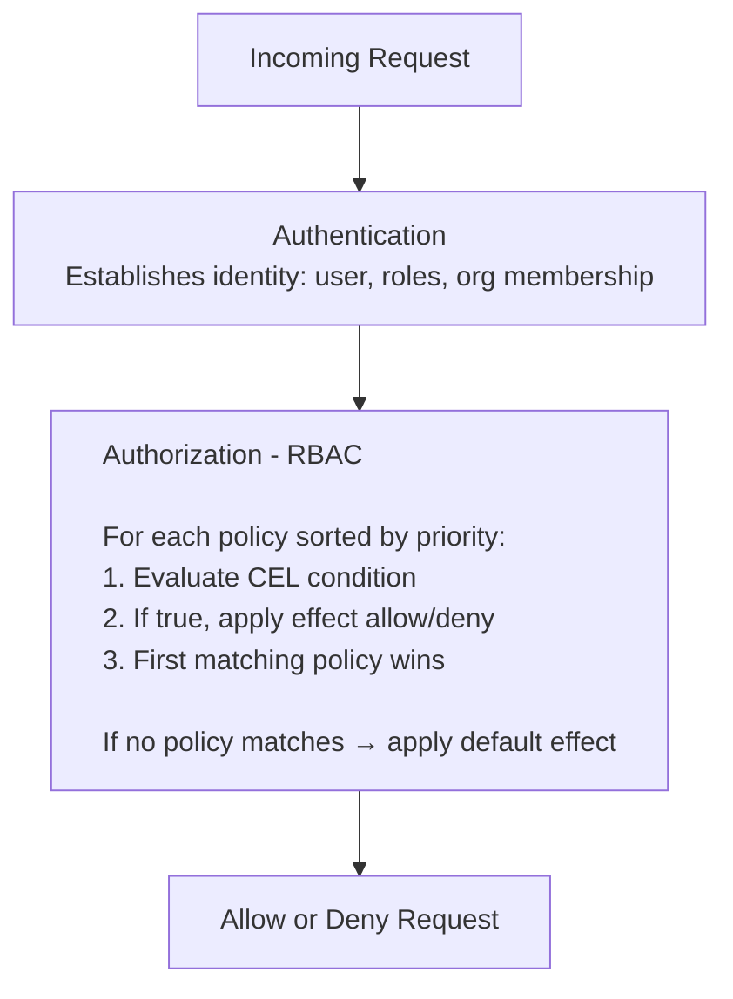
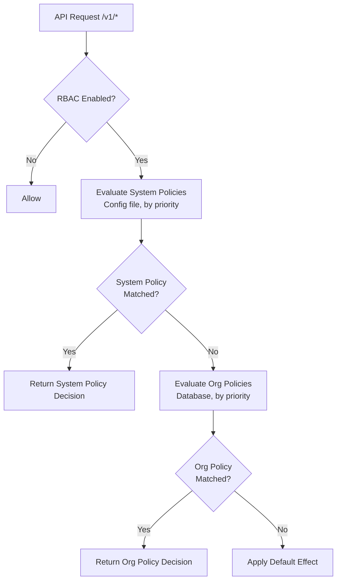

import { Callout } from "fumadocs-ui/components/callout";
import { StoryEmbed } from "@/components/story-embed";

Hadrian uses CEL (Common Expression Language) for fine-grained authorization. After authentication establishes _who_ a user is, authorization determines _what_ they can access.

## Overview

Authorization in Hadrian works through **policies** - rules that evaluate whether a request should be allowed or denied based on the authenticated user and the resource being accessed.



## Key Concepts

### Policies

A policy defines a rule for access control:

```toml
[[auth.rbac.policies]]
name = "org-admin-full-access"
description = "Organization admins can manage their organization"
resource = "organization"
action = "*"
condition = "'org_admin' in subject.roles && context.org_id in subject.org_ids"
effect = "allow"
priority = 80
```

| Field         | Description                                  |
| ------------- | -------------------------------------------- |
| `name`        | Unique identifier for the policy             |
| `description` | Human-readable explanation                   |
| `resource`    | Resource type this applies to (`*` for all)  |
| `action`      | Action type (`read`, `write`, `delete`, `*`) |
| `condition`   | CEL expression that must evaluate to `true`  |
| `effect`      | `allow` or `deny`                            |
| `priority`    | Higher values are evaluated first            |

### Priority and Evaluation Order

Policies are evaluated in **descending priority order**. The first matching policy wins.

1. Higher `priority` policies are checked first
2. If priorities are equal, `deny` policies are checked before `allow`
3. If no policy matches, the `default_effect` applies

**Best practice:** Use high priority (100+) for admin policies, medium (50-80) for role-based access, low (10-20) for general access.

### Subject Variables

Information about the authenticated user:

| Variable              | Type     | Description                       |
| --------------------- | -------- | --------------------------------- |
| `subject.user_id`     | string   | Internal user ID                  |
| `subject.external_id` | string   | ID from identity provider         |
| `subject.email`       | string   | User's email address              |
| `subject.roles`       | string[] | Assigned roles                    |
| `subject.org_ids`     | string[] | Organizations the user belongs to |
| `subject.team_ids`    | string[] | Teams the user belongs to         |
| `subject.project_ids` | string[] | Projects the user belongs to      |

### Context Variables

Information about the request and resource:

| Variable                | Type   | Description                                        |
| ----------------------- | ------ | -------------------------------------------------- |
| `context.resource_type` | string | Type of resource (`user`, `team`, `project`, etc.) |
| `context.action`        | string | Action being performed                             |
| `context.resource_id`   | string | Specific resource ID                               |
| `context.org_id`        | string | Target organization                                |
| `context.team_id`       | string | Target team                                        |
| `context.project_id`    | string | Target project                                     |
| `context.owner_id`      | string | Resource owner ID                                  |

## Common Patterns

### Super Admin Access

Grant unrestricted access to super administrators:

```toml
[[auth.rbac.policies]]
name = "super-admin"
description = "Super admins have full access to everything"
resource = "*"
action = "*"
condition = "'super_admin' in subject.roles"
effect = "allow"
priority = 100
```

### Organization Isolation

Ensure users can only access resources within their organizations:

```toml
[[auth.rbac.policies]]
name = "org-isolation"
description = "Users can only access their own organizations"
resource = "*"
action = "*"
condition = "context.org_id == '' || context.org_id in subject.org_ids"
effect = "allow"
priority = 10
```

<Callout type="info">
  The `context.org_id == ''` check allows access to resources without an organization context (like
  listing available organizations).
</Callout>

### Org Admin Access

Organization admins can manage their organization:

```toml
[[auth.rbac.policies]]
name = "org-admin"
description = "Org admins can manage their organization"
resource = "*"
action = "*"
condition = "'org_admin' in subject.roles && context.org_id in subject.org_ids"
effect = "allow"
priority = 80
```

### Self-Service Resources

Users can manage their own resources:

```toml
[[auth.rbac.policies]]
name = "user-own-resources"
description = "Users can manage resources they own"
resource = "*"
action = "*"
condition = "context.owner_id == subject.user_id"
effect = "allow"
priority = 40
```

### Prevent Self-Deletion

Prevent users from accidentally deleting themselves:

```toml
[[auth.rbac.policies]]
name = "deny-self-delete"
description = "Users cannot delete themselves"
resource = "user"
action = "delete"
condition = "subject.user_id == context.resource_id"
effect = "deny"
priority = 200
```

<Callout type="warn">
  Deny policies should have high priority to ensure they're evaluated before allow policies.
</Callout>

### Read-Only Access for Members

Organization members get read access:

```toml
[[auth.rbac.policies]]
name = "org-member-read"
description = "Org members can read resources"
resource = "*"
action = "read"
condition = "context.org_id in subject.org_ids"
effect = "allow"
priority = 20
```

## Gateway Authorization

Gateway RBAC extends CEL policies to `/v1/*` endpoints (chat completions, embeddings, etc.), enabling control over:

- Which models users can access
- Token limits by tier
- Feature access (tools, file search, reasoning)
- Time-based restrictions

### API Context Variables

Additional variables available for API requests:

| Variable                           | Type   | Description                  |
| ---------------------------------- | ------ | ---------------------------- |
| `context.model`                    | string | Model being requested        |
| `context.request.max_tokens`       | int    | Max tokens requested         |
| `context.request.has_tools`        | bool   | Request includes tools       |
| `context.request.has_file_search`  | bool   | Request uses RAG/file search |
| `context.request.stream`           | bool   | Streaming requested          |
| `context.request.reasoning_effort` | string | Reasoning level              |
| `context.request.has_images`       | bool   | Request contains images      |
| `context.now.hour`                 | int    | Current hour (0-23)          |
| `context.now.day_of_week`          | int    | Day of week (1=Mon, 7=Sun)   |

### Model Access Control

Restrict expensive models to premium users:

```toml
[[auth.rbac.policies]]
name = "premium-models"
description = "GPT-4 and Claude Opus require premium role"
resource = "model"
action = "use"
condition = """
  context.model != null &&
  (context.model.startsWith('gpt-4') || context.model.contains('opus')) &&
  !('premium' in subject.roles)
"""
effect = "deny"
priority = 90
```

### Token Limits by Tier

Enforce token limits based on user tier:

```toml
[[auth.rbac.policies]]
name = "basic-token-limit"
description = "Basic users limited to 2000 tokens"
resource = "model"
action = "use"
condition = """
  context.request.max_tokens > 2000 &&
  !('premium' in subject.roles)
"""
effect = "deny"
priority = 85
```

### Feature Gating

Restrict advanced features to specific roles:

```toml
# Require role for function calling
[[auth.rbac.policies]]
name = "tools-gate"
condition = "context.request.has_tools && !('tools_enabled' in subject.roles)"
effect = "deny"
priority = 85

# Require role for RAG/file search
[[auth.rbac.policies]]
name = "rag-gate"
condition = "context.request.has_file_search && !('rag_enabled' in subject.roles)"
effect = "deny"
priority = 85

# Require role for extended thinking/reasoning
[[auth.rbac.policies]]
name = "reasoning-gate"
condition = "context.request.reasoning_effort == 'high' && !('reasoning_enabled' in subject.roles)"
effect = "deny"
priority = 85
```

### Time-Based Access

Restrict API access to business hours:

```toml
[[auth.rbac.policies]]
name = "business-hours"
description = "Non-admins restricted to business hours (9 AM - 6 PM)"
resource = "model"
action = "use"
condition = """
  !('admin' in subject.roles) &&
  (context.now.hour < 9 || context.now.hour >= 18)
"""
effect = "deny"
priority = 80
```

## CEL Expression Tips

### String Operations

```
# Check if string starts with prefix
context.model.startsWith('gpt-4')

# Check if string contains substring
context.model.contains('opus')

# Check if string ends with suffix
subject.email.endsWith('@acme.com')
```

### List Operations

```
# Check if item is in list
'admin' in subject.roles

# Check if any item matches
subject.org_ids.exists(id, id == context.org_id)

# Check if all items match
subject.roles.all(role, role.startsWith('team_'))
```

### Null Safety

```
# Safe null check before comparison
context.model != null && context.model.startsWith('gpt-4')

# Default value pattern
(context.org_id ?? '') in subject.org_ids
```

### Combining Conditions

```
# AND - both must be true
'admin' in subject.roles && context.org_id in subject.org_ids

# OR - either can be true
'super_admin' in subject.roles || 'org_admin' in subject.roles

# NOT - invert condition
!('restricted' in subject.roles)
```

## Per-Organization Policies

In addition to system-level policies defined in the configuration file, Hadrian supports runtime policy management at the organization level through the Admin API and UI.

### Overview

Per-organization policies enable:

- **Self-service management** - Organization admins can create and manage their own access rules
- **Customer-specific rules** - Different organizations can have different access policies
- **Runtime updates** - Policies can be modified without restarting the gateway
- **Version control** - Every policy change is tracked with full history

<Callout type="info">
  **Policy Limits:** Each organization can have up to 100 policies by default. This limit prevents
  unbounded policy growth that could affect performance. Configure via
  `limits.resource_limits.max_policies_per_org` in your gateway config. Set to 0 for unlimited.
</Callout>

<Callout type="info">
  System policies (defined in the config file) always take precedence over organization policies.
  Use system policies for platform-wide rules and organization policies for tenant-specific
  customization.
</Callout>

<Callout type="warn">
  **Scope:** Organization policies are evaluated for **API endpoints** (`/v1/*`) only. Admin
  endpoints (`/admin/*`) are governed by system policies, ensuring platform-wide consistency for
  administrative operations. This design allows org admins to customize API access (model usage,
  rate limits) without affecting admin functionality.
</Callout>

### Policy Evaluation Order

When an **API request** (`/v1/*`) is authorized, policies are evaluated in this order:



1. **RBAC disabled** - If RBAC is globally disabled, all requests are allowed
2. **System policies first** - Policies from the config file are evaluated in priority order
3. **System policy match** - If a system policy matches, its decision is returned immediately
4. **Org policies second** - Organization-specific policies from the database are evaluated
5. **Org policy match** - If an org policy matches, its decision is returned
6. **Default effect** - If no policy matches, the configured `default_effect` applies

For **admin requests** (`/admin/*`), only system policies are evaluated (steps 1-3), then the default effect is applied.

### Managing Policies via Admin UI

Navigate to **Admin → Organizations → [Org] → RBAC Policies** to manage organization policies.

#### Policy List

The policy list shows all policies for the organization, sorted by priority. Enabled policies are actively enforced; disabled policies are stored but not evaluated.

<StoryEmbed storyId="admin-orgrbacpoliciespage--with-policies" height={500} />

#### Creating a Policy

Click **Create Policy** to open the policy form. Each policy requires:

- **Name** - Unique identifier (kebab-case recommended)
- **Resource** - Resource type this applies to (`*` for all)
- **Action** - Action type (`read`, `write`, `delete`, `*`)
- **Condition** - CEL expression that must evaluate to `true`
- **Effect** - `allow` or `deny`
- **Priority** - Higher values are evaluated first

<StoryEmbed storyId="admin-rbacpolicyformmodal--create-mode" height={550} />

<Callout type="info">
  CEL expressions are validated when you save. Invalid expressions will show an error with details
  about the syntax issue.
</Callout>

#### Editing a Policy

Click a policy row to edit it. Changes create a new version - the previous version is preserved in the version history.

<StoryEmbed storyId="admin-rbacpolicyformmodal--edit-mode" height={550} />

### Policy Simulation

Test policies before deployment using the simulator. Enter a hypothetical request context and see which policy would match and what decision would be returned.

<StoryEmbed storyId="admin-rbacpolicysimulator--default" height={400} />

The simulator shows:

- **RBAC Status** - Whether RBAC is enabled (when disabled, all requests are allowed)
- **Decision** - Whether the request would be allowed or denied
- **Matched Policy** - Which policy determined the decision and its source (System or Organization)
- **System Policies** - All system policies (from config) evaluated in priority order
- **Organization Policies** - All org policies (from database) evaluated in priority order

<Callout type="info">
  The simulator evaluates both system policies (from `hadrian.toml`) and organization policies (from
  the database), matching the runtime authorization flow. System policies are always evaluated first
  and take precedence over organization policies.
</Callout>

Use simulation to:

- Debug unexpected authorization failures
- Test new policies before enabling them
- Verify policy interactions and priority ordering
- Validate CEL expressions with realistic data
- Understand the interaction between system and organization policies

### Version History and Rollback

Every policy change creates a new version. View the complete history of a policy to see what changed, when, and by whom.

<StoryEmbed storyId="admin-rbacpolicyversionhistorymodal--with-versions" height={400} />

#### Rollback

To restore a previous version:

1. Open the policy's version history
2. Select the version to restore
3. Click **Rollback to this version**
4. Confirm the rollback

<Callout type="warn">
  Rollback creates a new version with the restored configuration - it doesn't delete the
  intermediate versions. The version history remains complete for audit purposes.
</Callout>

### Common Org-Level Patterns

These patterns are useful for organization-specific access rules.

#### Restrict SSO Config to Org Admins

Only organization administrators can modify SSO settings:

```toml
name = "restrict-sso-config"
resource = "sso_config"
action = "*"
condition = "'org_admin' in subject.roles"
effect = "allow"
priority = 100
```

#### Team Leads Manage Their Members

Team leads can add/remove members from their own teams:

```toml
name = "team-lead-manage-members"
resource = "team_member"
action = "*"
condition = "'team_lead' in subject.roles && context.team_id in subject.team_ids"
effect = "allow"
priority = 50
```

#### Deny API Key Creation for Contractors

External contractors cannot create API keys:

```toml
name = "deny-contractor-api-keys"
resource = "api_key"
action = "create"
condition = "subject.email.endsWith('@contractor.acme.com')"
effect = "deny"
priority = 200
```

#### Finance Team Only for Pricing

Only finance team members can modify model pricing:

```toml
name = "finance-only-pricing"
resource = "model_pricing"
action = "*"
condition = "'finance' in subject.roles"
effect = "allow"
priority = 75
```

#### Time-Based Access Restrictions

Restrict certain actions to business hours (org-specific timezone rules):

```toml
name = "business-hours-only"
resource = "sensitive_data"
action = "*"
condition = "context.now.hour >= 9 && context.now.hour < 18 && context.now.day_of_week >= 1 && context.now.day_of_week <= 5"
effect = "allow"
priority = 60
```

### Admin API Reference

Manage organization RBAC policies programmatically via the Admin API.

#### List Policies

```http
GET /admin/v1/organizations/{org_slug}/rbac-policies
```

Query parameters:

- `limit` - Maximum policies to return (default: 100, max: 1000)
- `offset` - Pagination offset

#### Create Policy

```http
POST /admin/v1/organizations/{org_slug}/rbac-policies
Content-Type: application/json

{
  "name": "require-admin-for-settings",
  "description": "Restricts settings access to administrators only",
  "resource": "settings",
  "action": "*",
  "condition": "'admin' in subject.roles",
  "effect": "deny",
  "priority": 100,
  "enabled": true
}
```

#### Get Policy

```http
GET /admin/v1/organizations/{org_slug}/rbac-policies/{policy_id}
```

#### Update Policy

```http
PATCH /admin/v1/organizations/{org_slug}/rbac-policies/{policy_id}
Content-Type: application/json

{
  "description": "Updated description",
  "priority": 90,
  "enabled": false
}
```

Only include fields you want to update. Each update creates a new version.

#### Delete Policy

```http
DELETE /admin/v1/organizations/{org_slug}/rbac-policies/{policy_id}
```

<Callout type="warn">
  Deleting a policy is permanent. Consider disabling instead to preserve history.
</Callout>

#### List Versions

```http
GET /admin/v1/organizations/{org_slug}/rbac-policies/{policy_id}/versions
```

Returns all versions of the policy, newest first.

#### Rollback to Version

```http
POST /admin/v1/organizations/{org_slug}/rbac-policies/{policy_id}/rollback
Content-Type: application/json

{
  "target_version": 2,
  "reason": "Reverting due to unintended access change"
}
```

Restores the policy configuration from the specified version number. The `reason` field is optional but recommended for audit purposes.

#### Simulate Policy

```http
POST /admin/v1/organizations/{org_slug}/rbac-policies/simulate
Content-Type: application/json

{
  "subject": {
    "user_id": "user-123",
    "email": "alice@acme.com",
    "roles": ["developer", "team_lead"],
    "org_ids": ["org-123"],
    "team_ids": ["team-456"]
  },
  "context": {
    "resource_type": "project",
    "action": "delete",
    "resource_id": "proj-789",
    "org_id": "org-123",
    "team_id": "team-456"
  }
}
```

Response:

```json
{
  "rbac_enabled": true,
  "allowed": true,
  "matched_policy": "team-lead-manage-members",
  "matched_policy_source": "organization",
  "reason": "Matched organization policy 'team-lead-manage-members' with effect 'allow'",
  "system_policies_evaluated": [
    {
      "name": "super-admin-access",
      "source": "system",
      "description": "Super admins have full access",
      "priority": 100,
      "effect": "allow",
      "pattern_matched": true,
      "condition_matched": false
    }
  ],
  "org_policies_evaluated": [
    {
      "id": "550e8400-e29b-41d4-a716-446655440001",
      "name": "deny-contractor-api-keys",
      "source": "organization",
      "priority": 200,
      "effect": "deny",
      "pattern_matched": false,
      "condition_matched": null
    },
    {
      "id": "550e8400-e29b-41d4-a716-446655440002",
      "name": "team-lead-manage-members",
      "source": "organization",
      "priority": 50,
      "effect": "allow",
      "pattern_matched": true,
      "condition_matched": true
    }
  ]
}
```

Response fields:

| Field                       | Type   | Description                                                                  |
| --------------------------- | ------ | ---------------------------------------------------------------------------- |
| `rbac_enabled`              | bool   | Whether RBAC is enabled. If false, all requests are allowed                  |
| `allowed`                   | bool   | Whether the request would be allowed                                         |
| `matched_policy`            | string | Name of the policy that determined the decision (if any)                     |
| `matched_policy_source`     | string | Source of the matched policy: `system` (config) or `organization` (database) |
| `reason`                    | string | Human-readable explanation of the decision                                   |
| `system_policies_evaluated` | array  | System policies (from config) evaluated, in priority order                   |
| `org_policies_evaluated`    | array  | Organization policies (from database) evaluated, in priority order           |

#### Validate CEL Expression

```http
POST /admin/v1/rbac-policies/validate
Content-Type: application/json

{
  "condition": "'admin' in subject.roles && context.org_id != ''"
}
```

Response (valid):

```json
{
  "valid": true,
  "error": null
}
```

Response (invalid):

```json
{
  "valid": false,
  "error": "undeclared reference to 'subjct' (did you mean 'subject'?)"
}
```

## Audit Logging

Authorization decisions can be logged for compliance:

```toml
[auth.rbac.audit]
log_allowed = false  # Log successful authorizations
log_denied = true    # Log denied requests (recommended)
```

Denied requests are logged with:

- User identity
- Requested resource and action
- Which policy caused the denial
- Request context

## Policy Cache Performance

For deployments with many organizations, Hadrian provides options to control how organization RBAC policies are cached in memory.

### Lazy Loading

By default, all organization policies are loaded into memory at startup (eager loading). For large deployments with thousands of organizations, enable lazy loading to:

- Reduce startup time
- Scale memory usage with active organizations rather than total organizations
- Avoid loading policies for organizations that may never be accessed

```toml
[auth.rbac]
enabled = true
lazy_load_policies = true  # Load policies on first request instead of at startup
```

With lazy loading enabled:

- Policies are loaded from the database when an organization is first accessed
- Subsequent requests use the cached policies (with TTL-based staleness checks)
- The first request for each org incurs a small latency penalty for the database lookup

### LRU Cache Eviction

To bound memory usage in large deployments, configure LRU (Least Recently Used) cache eviction:

```toml
[auth.rbac]
enabled = true
lazy_load_policies = true
max_cached_orgs = 10000        # Maximum orgs to cache (0 = unlimited)
policy_eviction_batch_size = 100  # Orgs to evict when cache is full
```

| Option                       | Default | Description                                         |
| ---------------------------- | ------- | --------------------------------------------------- |
| `lazy_load_policies`         | `false` | Load policies on-demand instead of at startup       |
| `max_cached_orgs`            | `0`     | Maximum orgs in cache (0 = unlimited)               |
| `policy_eviction_batch_size` | `100`   | Number of orgs to evict when cache reaches capacity |

When the cache reaches `max_cached_orgs`:

1. The `policy_eviction_batch_size` least recently used organizations are evicted
2. Evicted orgs have their policies reloaded from the database on next access
3. Access timestamps are updated on each authorization request

<Callout type="info">
  For deployments with hundreds of orgs, the default unlimited cache is fine. Consider enabling LRU
  eviction for deployments with 10,000+ organizations or when memory is constrained.
</Callout>

### Multi-Node Cache Consistency

In distributed deployments with Redis, policy changes propagate to all nodes via version-based cache invalidation:

```toml
[auth.rbac]
policy_cache_ttl_ms = 1000  # Check Redis for updates every 1 second
```

Each node checks Redis periodically for policy version changes. When a policy is updated on one node, other nodes detect the version mismatch and refresh from the database within `policy_cache_ttl_ms` milliseconds.

## Configuration Reference

For complete configuration options, see:

<Cards>
  <Card title="RBAC Configuration" href="/docs/configuration/auth#rbac-configuration" />
  <Card title="Gateway Authorization" href="/docs/configuration/auth#gateway-authorization" />
  <Card title="CEL Variables Reference" href="/docs/configuration/auth#cel-variables" />
</Cards>

## Related Topics

<Cards>
  <Card title="Authentication" href="/docs/authentication" />
  <Card title="Multi-Tenancy" href="/docs/features/multi-tenancy" />
  <Card title="SSO Admin Guide" href="/docs/features/sso-admin-guide" />
</Cards>
