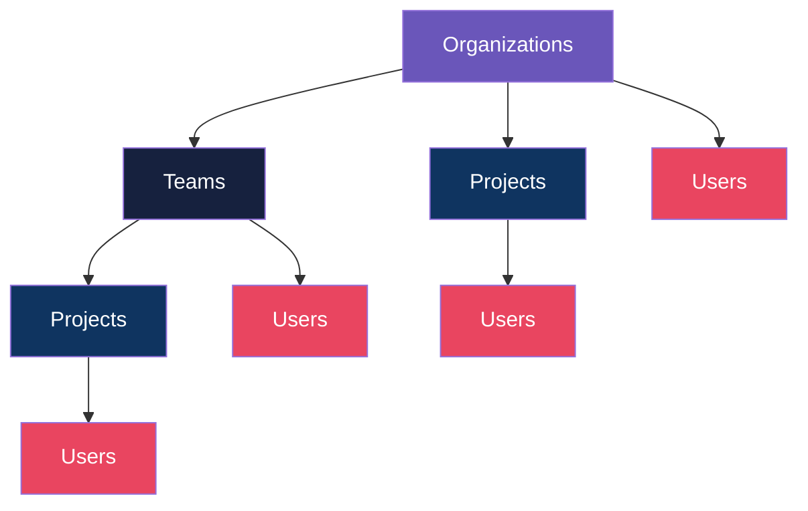

import { Callout } from "fumadocs-ui/components/callout";

Hadrian supports a flexible multi-tenancy hierarchy that scales from single-user deployments to large enterprises with complex organizational structures.

## Hierarchy Structure



### Entities

| Entity              | Description                                                   | Identifier                         |
| ------------------- | ------------------------------------------------------------- | ---------------------------------- |
| **Organizations**   | Top-level containers for all resources                        | `org_slug`                         |
| **Team**            | Optional grouping within an organization                      | `team_slug` (unique within org)    |
| **Project**         | Workspace boundary for resources                              | `project_slug` (unique within org) |
| **User**            | Individual identity (from SSO or local)                       | `external_id` or `user_id`         |
| **Service Account** | Machine identity for automated systems with role-based access | `sa_slug` (unique within org)      |

All entities use **slug-based URLs** for user-friendly API paths:

```
/admin/v1/organizations/{org_slug}
/admin/v1/organizations/{org_slug}/teams/{team_slug}
/admin/v1/organizations/{org_slug}/projects/{project_slug}
```

## Resource Ownership

Resources in Hadrian follow a consistent ownership pattern using `owner_type` and `owner_id` fields. This enables flexible scoping at any level of the hierarchy.

### Scoped Resources

| Resource              | Ownership Levels                          | Description                                   |
| --------------------- | ----------------------------------------- | --------------------------------------------- |
| **API Keys**          | Org, Team, Project, User, Service Account | Authentication credentials with budget limits |
| **Dynamic Providers** | Org, Team, Project, User                  | Custom LLM provider configurations            |
| **Collections**       | Org, Team, Project, User                  | Vector stores for RAG                         |
| **Files**             | Org, Team, Project, User                  | Uploaded documents and images                 |
| **Conversations**     | Project, User                             | Chat history                                  |
| **Prompts**           | Org, Team, Project, User                  | Reusable system prompt templates              |
| **Model Pricing**     | Org, Team, Project, User, Global          | Cost calculation overrides                    |

### Ownership Examples

**Organization-level API key** (shared across all teams/projects):

```json
POST /admin/v1/api-keys
{
  "name": "Shared Production Key",
  "owner": {
    "type": "organization",
    "organization_id": "550e8400-e29b-41d4-a716-446655440000"
  },
  "budget_limit_cents": 100000,
  "budget_period": "monthly"
}
```

**Project-level API key** (isolated to specific project):

```json
POST /admin/v1/api-keys
{
  "name": "Dev Project Key",
  "owner": {
    "type": "project",
    "project_id": "660e8400-e29b-41d4-a716-446655440001"
  },
  "budget_limit_cents": 10000,
  "budget_period": "daily"
}
```

**User-level API key** (personal key):

```json
POST /admin/v1/api-keys
{
  "name": "My Personal Key",
  "owner": {
    "type": "user",
    "user_id": "770e8400-e29b-41d4-a716-446655440002"
  }
}
```

**Service account API key** (machine identity with roles):

```json
POST /admin/v1/api-keys
{
  "name": "CI/CD Pipeline Key",
  "owner": {
    "type": "service_account",
    "service_account_id": "880e8400-e29b-41d4-a716-446655440004"
  },
  "budget_limit_cents": 50000,
  "budget_period": "monthly"
}
```

When an API key is owned by a service account, the service account's roles are used for RBAC evaluation. This enables machine identities to participate in role-based authorization just like users.

## Dynamic Providers

Bring your own API keys at any scope. This allows teams or projects to use their own provider credentials while sharing the gateway infrastructure.

### Configuration

Dynamic providers can be created via the Admin API:

```json
POST /admin/v1/dynamic-providers
{
  "name": "Team OpenAI",
  "provider_type": "openai",
  "owner": {
    "type": "team",
    "team_id": "880e8400-e29b-41d4-a716-446655440003"
  },
  "base_url": "https://api.openai.com/v1",
  "api_key": "sk-..."
}
```

### Provider Resolution

When a request arrives, Hadrian resolves providers in this order:

1. **User-level** provider (if exists)
2. **Project-level** provider (if exists)
3. **Team-level** provider (if exists)
4. **Organization-level** provider (if exists)
5. **Global** provider (from `hadrian.toml`)

This cascading resolution allows:

- Individual users to test with personal API keys
- Projects to have dedicated provider accounts
- Organizations to set defaults while allowing overrides

### Dynamic Routing

Use dynamic routing to specify the scope in the model string:

```bash
# Route through organization's provider
curl -X POST http://localhost:8080/v1/chat/completions \
  -H "Authorization: Bearer $API_KEY" \
  -d '{
    "model": ":org/acme-corp/openai/gpt-4o",
    "messages": [{"role": "user", "content": "Hello"}]
  }'

# Route through project's provider
curl -X POST http://localhost:8080/v1/chat/completions \
  -H "Authorization: Bearer $API_KEY" \
  -d '{
    "model": ":org/acme-corp/:project/ml-research/anthropic/claude-sonnet-4-20250514",
    "messages": [{"role": "user", "content": "Hello"}]
  }'

# Route through user's provider
curl -X POST http://localhost:8080/v1/chat/completions \
  -H "Authorization: Bearer $API_KEY" \
  -d '{
    "model": ":org/acme-corp/:user/alice/openai/gpt-4o",
    "messages": [{"role": "user", "content": "Hello"}]
  }'
```

## Cascading Settings

Settings cascade from specific to general, allowing overrides at any level.

### Model Pricing Cascade

Pricing lookups follow this order (first match wins):

```
User pricing     →  Most specific
Project pricing  →  ↓
Team pricing     →  ↓
Org pricing      →  ↓
Global pricing   →  Fallback (from config or provider API)
```

**Example:** Set custom pricing for a specific project:

```json
POST /admin/v1/model-pricing
{
  "provider": "openai",
  "model": "gpt-4o",
  "input_cost_per_million": 2500,
  "output_cost_per_million": 10000,
  "owner": {
    "type": "project",
    "project_id": "660e8400-e29b-41d4-a716-446655440001"
  }
}
```

Requests from this project use the custom pricing; other projects fall back to org or global pricing.

### Pricing Sources

| Source         | Description                              |
| -------------- | ---------------------------------------- |
| `manual`       | User-configured, never overwritten       |
| `provider_api` | Fetched from provider (e.g., OpenRouter) |
| `default`      | System defaults                          |

Manual pricing always takes precedence over automatic updates.

## Membership Management

Users belong to organizations, teams, and projects through membership records.

### Membership Levels

| Membership              | Description                                 |
| ----------------------- | ------------------------------------------- |
| **org_memberships**     | Users → Organizations (required for access) |
| **team_memberships**    | Users → Teams (optional grouping)           |
| **project_memberships** | Users → Projects (workspace access)         |

### Roles

Each membership includes a role for authorization:

```json
POST /admin/v1/organizations/{org_slug}/members
{
  "user_id": "770e8400-e29b-41d4-a716-446655440002",
  "role": "admin"
}
```

Common roles:

- `owner` - Full control, can delete the resource
- `admin` - Manage members and settings
- `member` - Standard access
- `viewer` - Read-only access

<Callout type="info">
  Roles are enforced through CEL-based authorization policies. See
  [Authorization](/docs/features/authorization) for policy configuration.
</Callout>

## Service Accounts

Service accounts are machine identities for automated systems, CI/CD pipelines, and background jobs. Unlike user accounts, service accounts carry roles directly, enabling role-based access control for API key authentication.

### Why Service Accounts?

Traditional API key authentication lacks role information:

```
API Key → Owner (org/team/project/user) → No roles!
```

This breaks RBAC policies that check `subject.roles`. Service accounts solve this by acting as a bridge:

```
API Key → Service Account → Roles → RBAC works!
```

### Creating a Service Account

```bash
curl -X POST http://localhost:8080/admin/v1/organizations/acme-corp/service-accounts \
  -H "Authorization: Bearer $ADMIN_KEY" \
  -H "Content-Type: application/json" \
  -d '{
    "slug": "ci-cd-bot",
    "name": "CI/CD Bot",
    "description": "Automated deployment service account",
    "roles": ["deployer", "viewer"]
  }'
```

### Service Account Fields

| Field         | Description                                          |
| ------------- | ---------------------------------------------------- |
| `slug`        | URL-friendly identifier (unique within organization) |
| `name`        | Display name                                         |
| `description` | Optional description                                 |
| `roles`       | List of roles for RBAC evaluation                    |

<Callout type="info">
  Service accounts are the foundation for the Unified Principal Model. API keys can be owned by
  service accounts, enabling machine identities to participate in role-based authorization. When an
  API key owned by a service account is used, the service account's roles are evaluated in RBAC
  policies.
</Callout>

### Role Mapping

Service account roles are processed through the same `role_mapping` configuration as user roles from identity providers. This allows consistent role normalization:

```toml
[auth.rbac]
role_mapping = { "deployer" = "deploy_admin", "viewer" = "read_only" }
```

With this configuration, a service account with roles `["deployer", "viewer"]` will have mapped roles `["deploy_admin", "read_only"]` in RBAC policy evaluation.

### Priority with Identity Auth

When both API key (service account) and identity authentication are present (e.g., API key used on behalf of a logged-in user), identity roles take precedence over service account roles. This ensures user-level policies always apply when a user identity is established.

## Principal Model

The Principal abstraction represents "who is making the request" regardless of the credential type used for authentication. This unified model simplifies authorization and audit logging by providing a consistent view of the authenticated actor.

### Principal Types

| Type               | Description                                         | Examples                          |
| ------------------ | --------------------------------------------------- | --------------------------------- |
| **User**           | Human identity from OIDC/SAML/proxy or user API key | SSO users, user-owned API keys    |
| **ServiceAccount** | Machine identity with explicit roles                | CI/CD bots, deployment automation |
| **Machine**        | Shared/organizational credential (no roles)         | Org/team/project-owned API keys   |

### Principal Derivation

The principal is derived from the authentication context:

```
API Key only:
  - Service account owner → ServiceAccount principal (with SA roles)
  - User owner → User principal (user_id, no identity roles)
  - Org/Team/Project owner → Machine principal (scope only)

Identity only (OIDC/SAML/proxy):
  - Always User principal (with identity roles and claims)

Both (API key + Identity):
  - Service account owner → ServiceAccount principal (SA takes precedence)
  - Otherwise → User principal (identity provides fields)
```

### Using Principal in Code

Access the principal from any authenticated request:

```rust
use crate::auth::{AuthenticatedRequest, Principal};

fn handle_request(auth: &AuthenticatedRequest) {
    let principal = auth.principal();

    match principal {
        Principal::User { email, roles, .. } => {
            // Handle human user
        }
        Principal::ServiceAccount { id, roles, .. } => {
            // Handle service account
        }
        Principal::Machine { kind } => {
            // Handle shared credential
        }
    }
}
```

### Principal for RBAC

Convert a principal to a Subject for policy evaluation:

```rust
let subject = principal.to_subject();
// subject now has all fields needed for CEL policy evaluation
```

### Principal for Audit Logging

Get the appropriate audit actor type:

```rust
let actor_type = principal.actor_type();
// Returns: User, ServiceAccount, ApiKey, or System
```

## Usage Tracking

Usage is tracked with full attribution context, enabling analytics at every level of the hierarchy. Each request records the authenticated user, organization, project, team, and service account — regardless of whether the request was made with an API key or a browser session.

### Attribution

| Source              | Attribution                                                               |
| ------------------- | ------------------------------------------------------------------------- |
| API key (org-owned) | `org_id` from key owner                                                   |
| API key (project)   | `org_id` and `project_id` from key owner                                  |
| API key (team)      | `org_id` and `team_id` from key owner                                     |
| API key (user)      | `org_id` and `user_id` from key owner                                     |
| API key (SA)        | `org_id` and `service_account_id` from service account                    |
| Session (SSO/proxy) | `user_id` and `org_id` from session; `project_id` via `X-Hadrian-Project` |

Session-based users can set the `X-Hadrian-Project` header (or use the project picker in the chat UI) to attribute their usage to a specific project.

### Usage Analytics API

Usage data is available through the Admin API at each scope:

| Scope        | Endpoints                                                                                                |
| ------------ | -------------------------------------------------------------------------------------------------------- |
| Organization | `GET /admin/v1/organizations/{org}/usage`, `by-date`, `by-model`                                         |
| Team         | `GET /admin/v1/organizations/{org}/teams/{team}/usage`, `by-date`, `by-model`, `by-provider`, `forecast` |
| Project      | `GET /admin/v1/organizations/{org}/projects/{project}/usage`, `by-date`, `by-model`                      |
| User         | `GET /admin/v1/users/{id}/usage`, `by-date`, `by-model`                                                  |
| API Key      | `GET /admin/v1/api-keys/{id}/usage`, `by-date`, `by-model`                                               |
| Self-service | `GET /admin/v1/me/usage`, `by-date`, `by-model` (no admin role required)                                 |

See [Budget Enforcement](/docs/features/budgets#usage-analytics) for details on the usage dashboards in the admin UI.

## Budget Enforcement

Budgets are enforced at the API key level, with keys scoped to any ownership level.

### Budget Configuration

```json
{
  "name": "Team Budget Key",
  "owner": {
    "type": "team",
    "team_id": "880e8400-e29b-41d4-a716-446655440003"
  },
  "budget_limit_cents": 50000,
  "budget_period": "monthly"
}
```

### Budget Periods

| Period    | Reset            | Use Case             |
| --------- | ---------------- | -------------------- |
| `daily`   | Midnight UTC     | Development, testing |
| `monthly` | 1st of month UTC | Production budgets   |

### Enforcement Flow

```
1. Request arrives with API key
2. Check current spend for key's budget period
3. Reserve estimated cost (atomic operation)
4. Forward to LLM provider
5. Adjust reservation with actual cost
6. Track in usage_records table
```

See [Budget Enforcement](/docs/features/budgets) for detailed configuration.

## Authorization

Hadrian uses CEL (Common Expression Language) policies for fine-grained access control.

### Authorization Context

Every request includes context for policy evaluation:

| Field                        | Description                                          |
| ---------------------------- | ---------------------------------------------------- |
| `subject.user_id`            | Authenticated user ID                                |
| `subject.org_id`             | User's organization                                  |
| `subject.roles`              | User's roles (from identity or service account)      |
| `subject.service_account_id` | Service account ID (if authenticated via SA API key) |
| `resource.type`              | Resource being accessed                              |
| `resource.owner_type`        | Owner level of resource                              |
| `resource.owner_id`          | Owner ID of resource                                 |

### Example Policies

```toml
[auth.rbac]

# Organization admins can manage all resources in their org
[[auth.rbac.policies]]
expression = "subject.org_id == resource.org_id && 'admin' in subject.roles"
permissions = ["*"]

# Users can only access their own resources
[[auth.rbac.policies]]
expression = "resource.owner_type == 'user' && resource.owner_id == subject.user_id"
permissions = ["read", "write", "delete"]

# Project members can read project resources
[[auth.rbac.policies]]
expression = "resource.owner_type == 'project' && resource.owner_id in subject.project_ids"
permissions = ["read"]

# Service accounts with 'deployer' role can call chat/completions
[[auth.rbac.policies]]
name = "service_account_deployer"
expression = "subject.service_account_id != '' && 'deployer' in subject.roles"
resources = ["chat_completions", "embeddings"]
permissions = ["write"]
```

### Cross-Org Isolation

By default, users cannot access resources outside their organization:

```toml
[[auth.rbac.policies]]
expression = "subject.org_id == resource.org_id"
permissions = ["read"]
```

This ensures complete isolation between organizations.

## Audit Logging

All administrative operations are logged with full context.

### Audit Log Fields

| Field           | Description                                       |
| --------------- | ------------------------------------------------- |
| `timestamp`     | When the action occurred                          |
| `actor_type`    | `user`, `api_key`, `service_account`, or `system` |
| `actor_id`      | ID of the actor                                   |
| `action`        | Operation (e.g., `team.create`, `api_key.revoke`) |
| `resource_type` | Type of affected resource                         |
| `resource_id`   | ID of affected resource                           |
| `org_id`        | Organization context                              |
| `project_id`    | Project context (if applicable)                   |
| `details`       | JSON with request details                         |
| `ip_address`    | Client IP                                         |
| `user_agent`    | Client user agent                                 |

### Querying Audit Logs

```bash
# Get audit logs for an organization
curl http://localhost:8080/admin/v1/organizations/{org_slug}/audit-logs \
  -H "Authorization: Bearer $ADMIN_KEY"

# Filter by action
curl "http://localhost:8080/admin/v1/organizations/{org_slug}/audit-logs?action=api_key.create" \
  -H "Authorization: Bearer $ADMIN_KEY"
```

## Session Management

Hadrian provides administrative control over user browser sessions, enabling the critical enterprise use case: **force logout terminated employees immediately**.

### Configuration

Enable enhanced session tracking in your configuration:

```toml
[auth.admin.session]
cookie_name = "__gw_session"
duration_secs = 604800  # 7 days

[auth.admin.session.enhanced]
enabled = true                    # Enable session tracking
track_devices = true              # Store user agent and device info
max_concurrent_sessions = 3       # Limit sessions per user (0 = unlimited)
inactivity_timeout_secs = 28800   # Auto-logout after 8 hours idle
```

<Callout type="info">
  Without enhanced session management enabled, the admin UI shows a notice explaining that session
  tracking is not available. Sessions will still work, but listing and revocation are not possible.
</Callout>

<Callout type="warn">
  **Session limit is eventually consistent.** The `max_concurrent_sessions` limit is checked after
  session creation, not before. During login, users may briefly exceed the limit by one session
  (e.g., `max + 1` sessions) before the oldest session is evicted. This is a deliberate design
  choice for performance: it avoids holding locks during the OAuth callback flow. Eviction is
  oldest-first and best-effort.
</Callout>

### Listing User Sessions

View all active sessions for a user:

```bash
curl http://localhost:8080/admin/v1/users/{user_id}/sessions \
  -H "Authorization: Bearer $ADMIN_KEY"
```

Response includes device information and timestamps:

```json
{
  "data": [
    {
      "id": "550e8400-e29b-41d4-a716-446655440000",
      "device": {
        "device_description": "Chrome 120 on Windows 11",
        "ip_address": "192.168.1.100"
      },
      "created_at": "2024-01-15T10:30:00Z",
      "last_activity": "2024-01-15T14:22:00Z",
      "expires_at": "2024-01-22T10:30:00Z"
    }
  ],
  "enhanced_enabled": true
}
```

### Force Logout All Sessions

Revoke all sessions for a user (e.g., terminated employee):

```bash
curl -X DELETE http://localhost:8080/admin/v1/users/{user_id}/sessions \
  -H "Authorization: Bearer $ADMIN_KEY"
```

Response:

```json
{
  "sessions_revoked": 3
}
```

### Revoke Single Session

Revoke a specific session:

```bash
curl -X DELETE http://localhost:8080/admin/v1/users/{user_id}/sessions/{session_id} \
  -H "Authorization: Bearer $ADMIN_KEY"
```

### Admin UI

The Sessions tab in the User Detail page provides a visual interface for session management:

- View all active sessions with device info and timestamps
- Revoke individual sessions with one click
- Force logout all sessions with confirmation dialog

Access it at `/admin/users/{user_id}` and select the "Sessions" tab.

## GDPR Compliance

Hadrian includes built-in support for GDPR data subject requests.

### Data Export

Export all data for a user:

```bash
GET /admin/v1/users/{user_id}/export
```

Returns:

- User profile
- Organization/team/project memberships
- API keys (without secrets)
- Conversations
- Active sessions (when enhanced session management is enabled)
- Usage summary
- Audit logs

### Data Deletion

Hard delete a user and all associated data:

```bash
DELETE /admin/v1/users/{user_id}?hard=true
```

This cascades to:

- API keys
- Conversations
- Dynamic providers
- Usage records
- Membership records

<Callout type="warn">
  Hard deletion is irreversible. Use soft deletion (`DELETE` without `?hard=true`) for recoverable
  removal.
</Callout>

## API Reference

### Organizations

| Method | Endpoint                                 | Description         |
| ------ | ---------------------------------------- | ------------------- |
| POST   | `/admin/v1/organizations`                | Create organization |
| GET    | `/admin/v1/organizations/{slug}`         | Get organization    |
| PATCH  | `/admin/v1/organizations/{slug}`         | Update organization |
| DELETE | `/admin/v1/organizations/{slug}`         | Delete organization |
| GET    | `/admin/v1/organizations/{slug}/members` | List members        |
| POST   | `/admin/v1/organizations/{slug}/members` | Add member          |

### Teams

| Method | Endpoint                                     | Description |
| ------ | -------------------------------------------- | ----------- |
| POST   | `/admin/v1/organizations/{org}/teams`        | Create team |
| GET    | `/admin/v1/organizations/{org}/teams/{slug}` | Get team    |
| PATCH  | `/admin/v1/organizations/{org}/teams/{slug}` | Update team |
| DELETE | `/admin/v1/organizations/{org}/teams/{slug}` | Delete team |

### Service Accounts

| Method | Endpoint                                                         | Description                   |
| ------ | ---------------------------------------------------------------- | ----------------------------- |
| POST   | `/admin/v1/organizations/{org}/service-accounts`                 | Create service account        |
| GET    | `/admin/v1/organizations/{org}/service-accounts`                 | List service accounts         |
| GET    | `/admin/v1/organizations/{org}/service-accounts/{slug}`          | Get service account           |
| PATCH  | `/admin/v1/organizations/{org}/service-accounts/{slug}`          | Update service account        |
| DELETE | `/admin/v1/organizations/{org}/service-accounts/{slug}`          | Delete service account        |
| GET    | `/admin/v1/organizations/{org}/service-accounts/{slug}/api-keys` | List service account API keys |

### Projects

| Method | Endpoint                                        | Description    |
| ------ | ----------------------------------------------- | -------------- |
| POST   | `/admin/v1/organizations/{org}/projects`        | Create project |
| GET    | `/admin/v1/organizations/{org}/projects/{slug}` | Get project    |
| PATCH  | `/admin/v1/organizations/{org}/projects/{slug}` | Update project |
| DELETE | `/admin/v1/organizations/{org}/projects/{slug}` | Delete project |

### Users

| Method | Endpoint                              | Description         |
| ------ | ------------------------------------- | ------------------- |
| GET    | `/admin/v1/users`                     | List users          |
| GET    | `/admin/v1/users/{id}`                | Get user            |
| GET    | `/admin/v1/users/{id}/export`         | Export user data    |
| DELETE | `/admin/v1/users/{id}`                | Delete user         |
| GET    | `/admin/v1/users/{id}/sessions`       | List user sessions  |
| DELETE | `/admin/v1/users/{id}/sessions`       | Revoke all sessions |
| DELETE | `/admin/v1/users/{id}/sessions/{sid}` | Revoke one session  |
